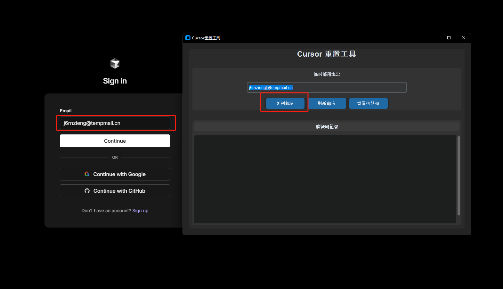
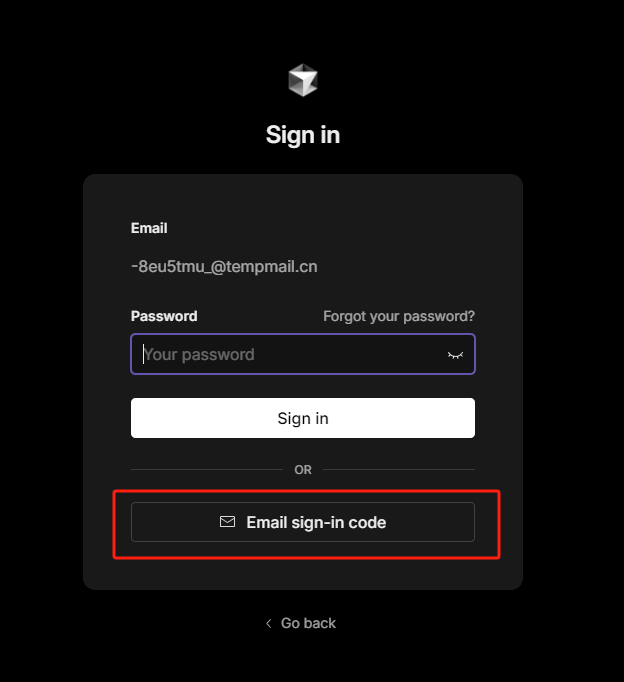
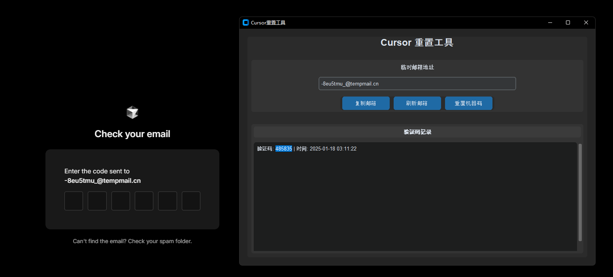
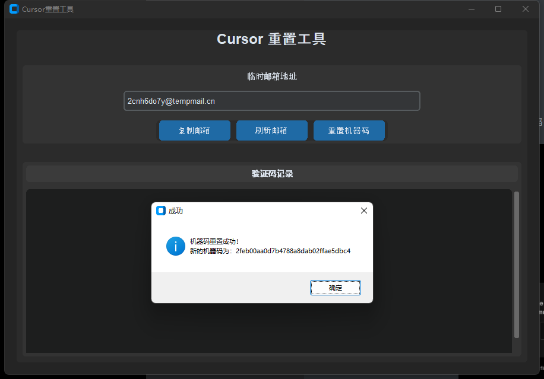

# easy4cursor
通过临时邮箱+重置cursor本地机器码的方式，实现无限试用pro权限。

下载安装程序：https://github.com/yuwenhao12/easy4cursor/releases

## 普通情况，更换账号

第一步，复制邮箱，然后点击继续

第二步，点击使用邮箱验证

第三步，填写验证码，完成注册。

## 免费账号使用限制，重置机器码

目前每台机器限制3个免费账号，可以通过修改机器码的情况绕过这个验证。

重置机器码时，需要先关闭cursor，否则不生效。

